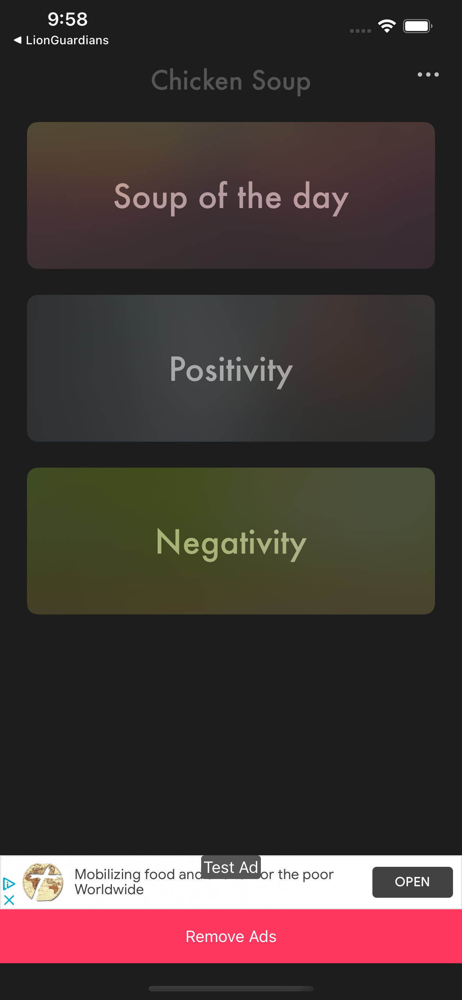
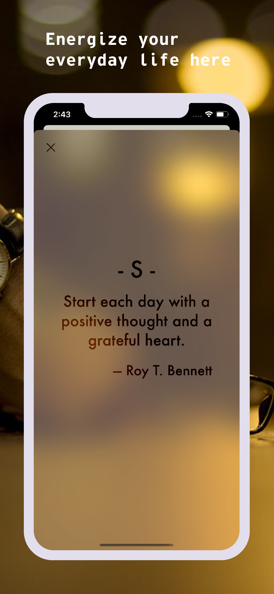
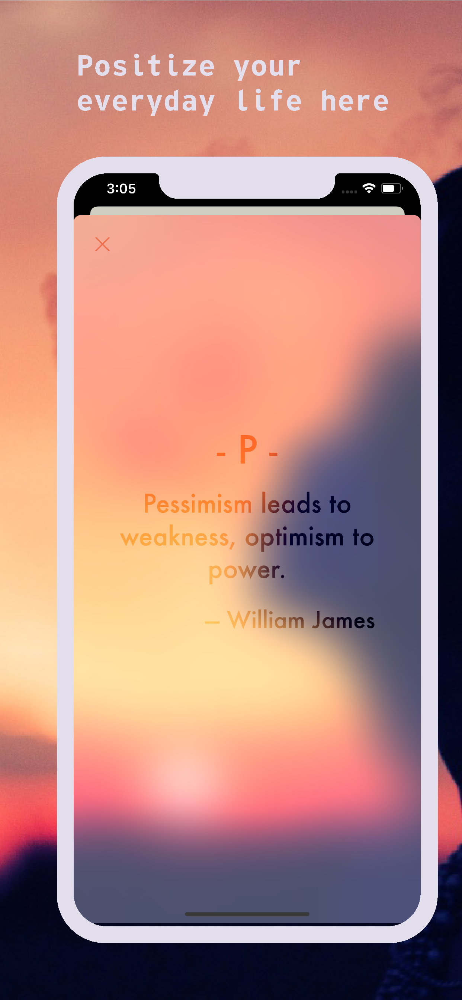
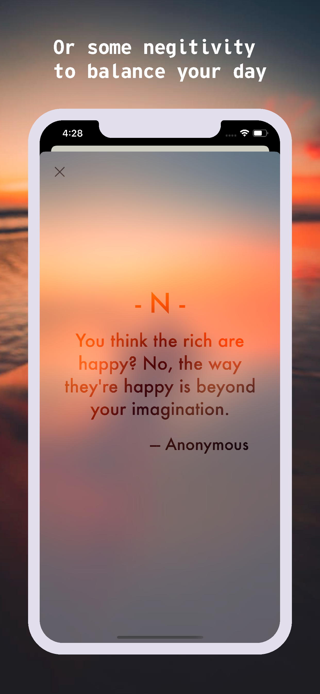

# ChickenSoup
To keep up with your daily life, everybody need inspiring and humorous quotes.

## Screenshots

## Flow
  1. Main page with three buttons to present three different categories of quotes
    - daily quote
    - positive quote
    - negative quote
  2. Imbed google ads to the app
    - user can remove the ad from their app

## Tech
#### MVC
  - Basic MVC design to separate view and viewContorller
  
#### TableView
  - Utilizing custom UITableViewCell to layout UITablenView.

#### Interactive MotionEffect
  - Utilizing UIInterpolatingMotionEffect to achieve an interactive motion effect experince with user

#### Blur & Vibrancy Effect
  - Build up UI mainly with blur and vibrancy effect

#### Google Ad
  - Integrate Google Ads to the app
  
#### In-App Purchase
  - Add an ad removal process with in-app purchase
  - can also restore the purchase with a "restore purchase" button

## Improvement
  - Continue to move all quotes to the firebase
  - Add more functions like sharing, store favorite quotes, ...ect

